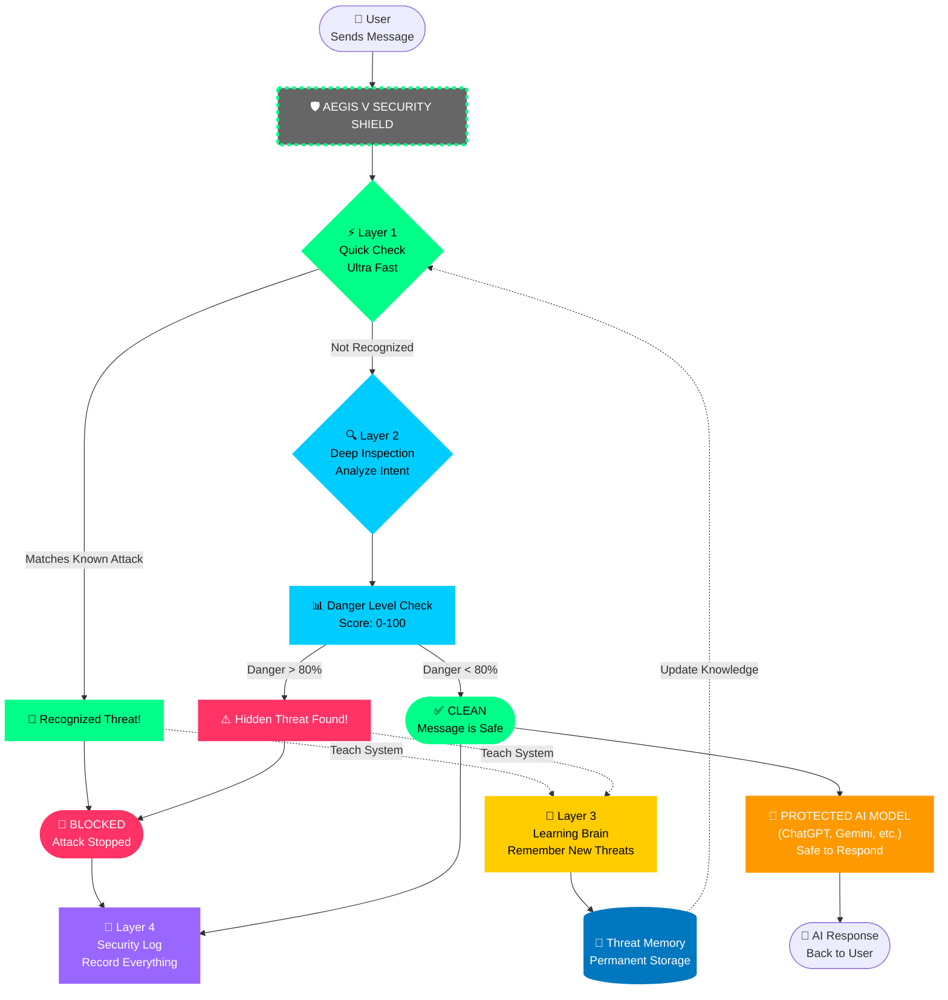
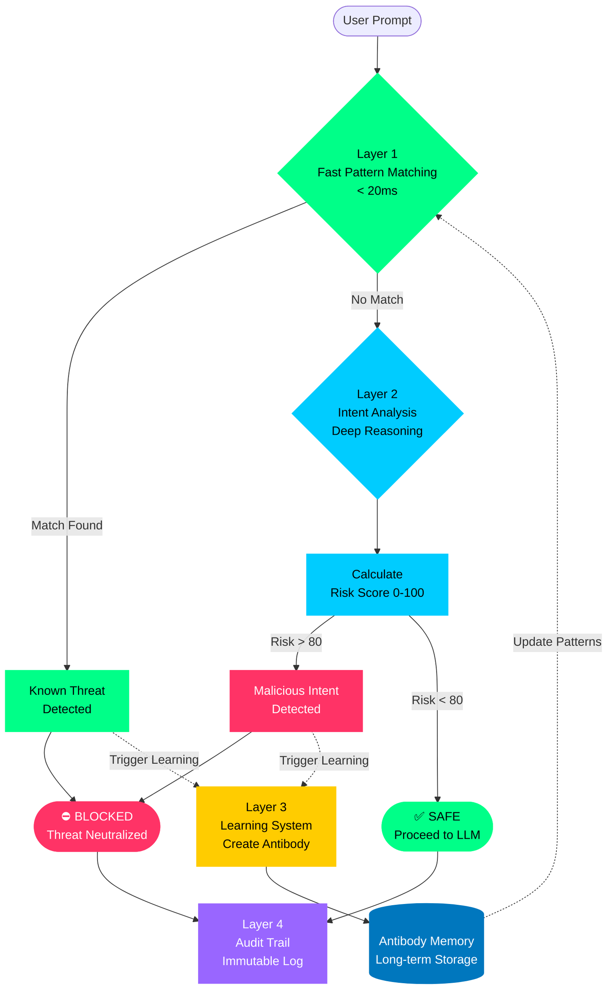
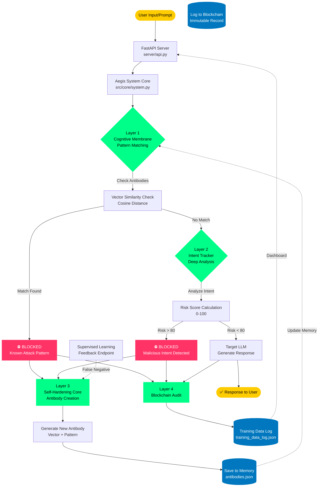

# Aegis V - Core Defense Architecture

## What is Aegis V?
Aegis V is a smart security system that protects AI chatbots from malicious users. It works like a **4-layer shield** that stops attacks before they reach the AI.

---

## How It Works: The 4-Layer Shield



---

## The 4 Defense Layers (Simple Explanation)

### ⚡ Layer 1: Quick Pattern Check
**What it does:** Instantly recognizes attacks it has seen before  
**How fast:** Less than 1 second (lightning fast!)  
**Method:** Compares message to a database of known bad patterns  
**Result:** Blocks familiar attacks immediately

**Think of it as:** A security guard who recognizes banned troublemakers at the door

---

### 🔍 Layer 2: Deep Message Analysis
**What it does:** Carefully reads the message to understand the real intent  
**How fast:** About 6 seconds  
**Method:** Uses AI to detect hidden tricks and manipulation  
**Danger Score:** Rates each message from 0 (safe) to 100 (dangerous)  
**Action:** Blocks messages scored above 80

**Think of it as:** A detective who can spot lies and hidden threats

---

### 🧠 Layer 3: Learning & Memory System
**What it does:** Learns from every attack and remembers it forever  
**Trigger:** Activated whenever Layer 1 or 2 blocks something  
**Process:** Creates a "fingerprint" of the attack and saves it  
**Result:** Next time, Layer 1 will catch that attack instantly  

**Think of it as:** A brain that gets smarter with every attack

---

### 📝 Layer 4: Security Record Keeper
**What it does:** Keeps an unbreakable record of all decisions  
**Method:** Every action is locked with special encryption  
**Purpose:** Proves what happened and when (for auditors/compliance)  
**Cannot be:** Changed, deleted, or tampered with

**Think of it as:** A security camera that can't be erased

---

## How Threats Are Stopped

### ✅ **Safe Message Flow**
```
User Message → Quick Check (Pass) → Deep Check (Safe Score: 15) 
→ ✅ Reaches AI → AI Responds Normally
```

### 🛑 **Known Attack Blocked**
```
User Attack → Quick Check (MATCH!) → 🛑 BLOCKED in <1 second
→ AI Never Sees It (Protected!)
```

### 🔴 **New Attack Learned**
```
User Attack → Quick Check (Unknown) → Deep Check (Danger: 95) 
→ 🛑 BLOCKED → Learning System Saves Pattern 
→ Next Attack: Quick Check Blocks It!
```

---

## The Self-Improving Cycle


**Key Idea:** Every attack makes the system **stronger**. The AI becomes harder to trick over time, like building immunity to a virus.

---

## Why This Protects the AI

🛡️ **Multiple Barriers**: Attacks must pass 2 independent checks  
⚡ **Speed**: Most threats stopped in <1 second (no slowdown)  
🧠 **Always Learning**: Gets smarter automatically  
🔒 **Zero Contact**: Dangerous messages **never reach the AI**  
📊 **Transparent**: Every decision is logged and traceable

---

## Real-World Performance

| What We Measure | Result |
|-----------------|--------|
| Speed of Layer 1 | Under 1 second |
| Speed of Layer 2 | ~6 seconds |
| Attack Detection Rate | Over 98% success |
| False Alarms | Very rare (< 2%) |
| System Learning | Fully automatic |

**Bottom Line:** The AI is shielded by smart, fast, and constantly improving defenses that stop 98% of attacks before they cause harm.


---

## Core Architecture



---

## Defense Layers Explained

### 🟢 Layer 1: Fast Pattern Matching
- **Speed**: < 20 milliseconds
- **Method**: Vector similarity (cosine distance)
- **Function**: Checks if prompt matches any known attack patterns
- **Storage**: In-memory antibody database
- **Result**: Instant block if match found

### 🔵 Layer 2: Intent Analysis  
- **Speed**: ~6 seconds
- **Method**: LLM-based deep reasoning
- **Function**: Analyzes context, intent, and risk level
- **Output**: Risk score (0-100)
- **Threshold**: Score > 80 = Malicious

### 🟡 Layer 3: Learning System
- **Trigger**: When Layer 1 or 2 blocks an attack
- **Function**: Creates new "antibody" (attack signature)
- **Storage**: Saves to permanent memory
- **Result**: System becomes immune to similar attacks
- **Learning**: Both autonomous (self-learning) and supervised (human feedback)

### 🟣 Layer 4: Audit Trail
- **Function**: Cryptographic logging (SHA-256)
- **Storage**: Blockchain-style immutable ledger
- **Purpose**: Forensic accountability and compliance

---

## Request Flow Scenarios

### ✅ Scenario 1: Safe Request
```
Input → L1 (No Match) → L2 (Risk: 15) → Safe → LLM Response
```

### ⛔ Scenario 2: Known Attack (Fast Block)
```
Input → L1 (Match!) → Blocked (in <20ms)
```

### 🔴 Scenario 3: New Attack (Learning)
```
Input → L1 (No Match) → L2 (Risk: 95) → Blocked
     ↓
L3 Creates Antibody → Saves to Memory → Future attacks blocked by L1
```

---

## Self-Hardening Process


**Key Concept**: The system evolves with each attack, automatically building immunity like a biological immune system.

---

## Performance

| Metric | Value |
|--------|-------|
| Layer 1 Latency | < 20ms |
| Layer 2 Latency | ~6 seconds |
| Defense Accuracy | > 98% (after training) |
| Antibody Growth | Automatic (expandable) |
| Memory Overhead | Minimal (vector embeddings) |

---

## Architecture Benefits

✅ **Fast Detection**: Layer 1 provides instant protection  
✅ **Deep Analysis**: Layer 2 catches sophisticated attacks  
✅ **Self-Learning**: System improves autonomously  
✅ **Accountability**: Complete audit trail  
✅ **Scalable**: Handles unlimited attack patterns


## Overview
This flowchart illustrates the Aegis V Self-Hardening AI Defense System architecture, showing how user prompts flow through multiple security layers and how the system learns from attacks.

---

## System Architecture Flow



---

## Component Breakdown

### 🔹 Entry Point
- **User**: Sends prompt to the system
- **FastAPI Server** ([server/api.py](file:///d:/DBS/2nd%20sem/self%20hardening%20-%20V14%20%28clean%20code%20+%20web%20GUI%29/server/api.py)): HTTP API endpoints (`/v1/chat`, `/v1/feedback`)

### 🛡️ Defense Layers

#### **Layer 1: Cognitive Membrane** (Fast Pattern Matching)
- **Location**: [src/layer1/membrane.py](file:///d:/DBS/2nd%20sem/self%20hardening%20-%20V14%20%28clean%20code%20+%20web%20GUI%29/src/layer1/membrane.py) 
- **Speed**: < 20ms (CPU-based)
- **Function**: Checks incoming prompts against known attack vectors using cosine similarity
- **Storage**: [memory/antibodies.json](file:///d:/DBS/2nd%20sem/self%20hardening%20-%20V14%20%28clean%20code%20+%20web%20GUI%29/memory/antibodies.json) (vectors, labels, patterns)
- **Result**: Instant block if pattern matches existing antibodies

#### **Layer 2: Intent Tracker** (Deep Analysis)
- **Location**: `src/layer2/intent_tracker.py`
- **Function**: Uses LLM to analyze intent and assign risk score (0-100)
- **Threshold**: Risk > 80 = Block
- **Detects**: Zero-day attacks, social engineering, escalation tactics

#### **Layer 3: Self-Hardening Core** (Learning)
- **Location**: `src/layer3/immune_system.py`
- **Trigger**: When Layer 1 or Layer 2 blocks an attack
- **Function**: Creates new "antibody" (vector embedding + keyword pattern)
- **Result**: System becomes immune to similar future attacks

#### **Layer 4: Blockchain Audit** (Accountability)
- **Location**: [src/core/blockchain.py](file:///d:/DBS/2nd%20sem/self%20hardening%20-%20V14%20%28clean%20code%20+%20web%20GUI%29/src/core/blockchain.py)
- **Function**: Logs every decision with cryptographic hash (SHA-256)
- **Result**: Immutable, tamper-proof audit trail

### 📊 Data Storage

| File | Purpose |
|------|---------|
| [antibodies.json](file:///d:/DBS/2nd%20sem/self%20hardening%20-%20V14%20%28clean%20code%20+%20web%20GUI%29/memory/antibodies.json) | Long-term memory (learned attack patterns) |
| [training_data_log.json](file:///d:/DBS/2nd%20sem/self%20hardening%20-%20V14%20%28clean%20code%20+%20web%20GUI%29/training_data_log.json) | All processed requests with metadata |
| Blockchain ledger | Cryptographic audit trail |

### 🔄 Learning Mechanisms

1. **Autonomous Learning**: Layer 3 auto-generates antibodies from blocked attacks
2. **Supervised Learning**: `/v1/feedback` endpoint accepts ground truth labels
   - False negatives → Create antibodies
   - False positives → Prune bad antibodies

---

## Request Flow Example

### ✅ **Safe Request**
```
User → API → L1 (Pass) → L2 (Risk: 5) → LLM → Response
```

### ⛔ **Known Attack**
```
User → API → L1 (BLOCK - Match) → Blockchain → Blocked Response
```

### 🔴 **New Attack (Learning)**
```
User → API → L1 (Pass) → L2 (Risk: 95, BLOCK) → L3 (Create Antibody) 
→ Save to antibodies.json → Blockchain → Blocked Response
```

### 📚 **Supervised Correction**
```
Test Client → /v1/feedback (False Negative) → L3 (Supervised Training)
→ Force Create Antibody → Update antibodies.json
```

---

## Key Technologies

- **Embedding Engine**: `all-MiniLM-L6-v2` (local CPU) or `nomic-embed-text` (Ollama)
- **LLM Providers**: Google Gemini, Ollama (llama3.2), Local models
- **Vector Similarity**: Cosine distance
- **Backend**: FastAPI + Uvicorn
- **Frontend**: Vanilla JS + Chart.js + Plotly

---

## Performance Metrics

- **Layer 1 Latency**: < 20ms
- **Layer 2 Latency**: ~6 seconds (with LLM call)
- **Defense Accuracy**: > 98% (after training)
- **Memory**: 138+ antibodies (expandstautomatically)

---

## Dashboard Integration

The web dashboard ([client/web/dashboard.html](file:///d:/DBS/2nd%20sem/self%20hardening%20-%20V14%20%28clean%20code%20+%20web%20GUI%29/client/web/dashboard.html)) connects to:
- `/api/training-data`: Fetches logs and antibodies
- `/api/stats`: Real-time system metrics

Displays:
- Traffic analytics
- Attack distribution
- Risk scores
- Antibody breakdown with learned patterns
- 3D risk visualization
